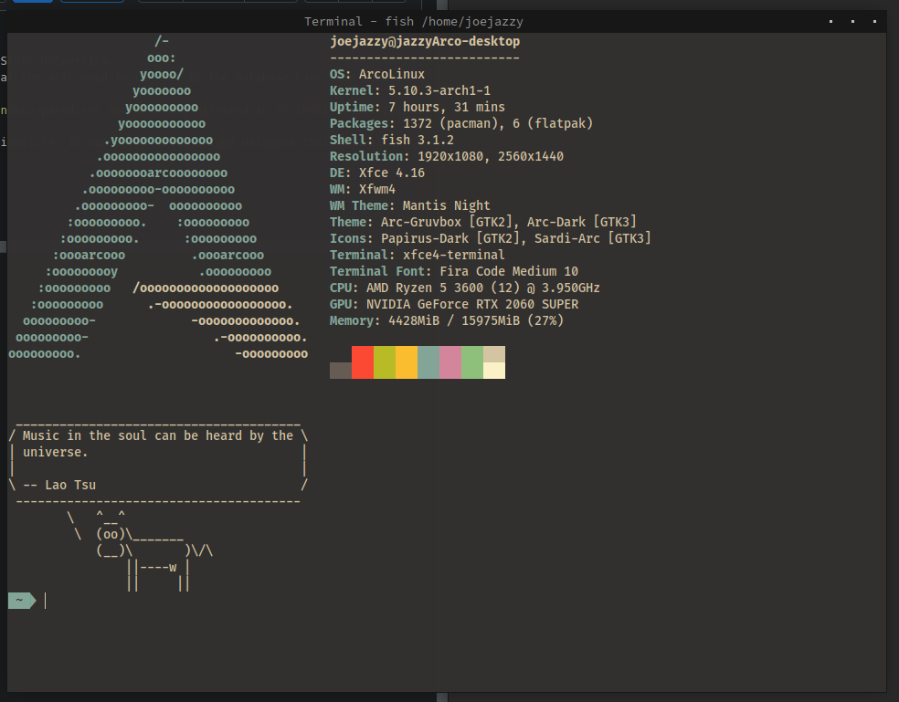

My fish shell uses [Oh My Fish (omf)](https://github.com/oh-my-fish/oh-my-fish) for theming and is set to the [agnoster](https://github.com/oh-my-fish/theme-agnoster) theme.
I run [neofetch](https://github.com/oh-my-fish/theme-agnoster), [fortune](https://wiki.archlinux.org/index.php/Fortune), and [cowsay](https://archlinux.org/packages/extra/any/cowsay/) on startup so without these installed the terminal will contain unknown commands.

I'm using the xfce4-terminal and have the color pallete set to the [Base16 Gruvbox](https://github.com/afq984/base16-xfce4-terminal) preset.

