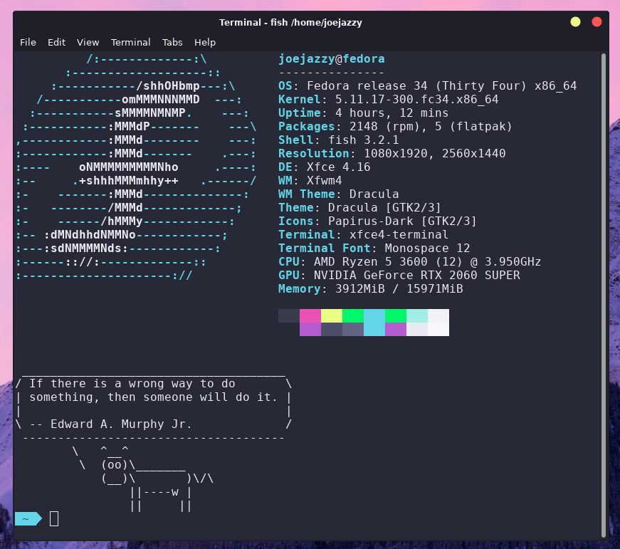

My fish shell uses [Oh My Fish (omf)](https://github.com/oh-my-fish/oh-my-fish) for theming and is set to the [agnoster](https://github.com/oh-my-fish/theme-agnoster) theme.
I run [neofetch](https://github.com/oh-my-fish/theme-agnoster), [fortune](https://fedora.pkgs.org/34/fedora-x86_64/fortune-mod-3.4.1-2.fc34.x86_64.rpm.html), and [cowsay](https://fedora.pkgs.org/34/fedora-x86_64/cowsay-3.04-17.fc34.noarch.rpm.html) on startup so without these installed the terminal will contain unknown commands.

I'm using the xfce4-terminal and have the color pallete set to the [Base16 Dracula](https://github.com/afq984/base16-xfce4-terminal) preset.

